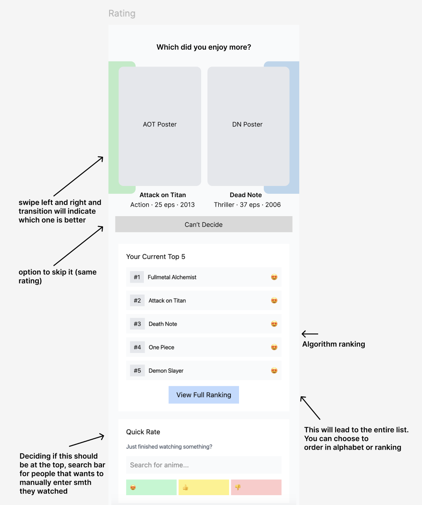
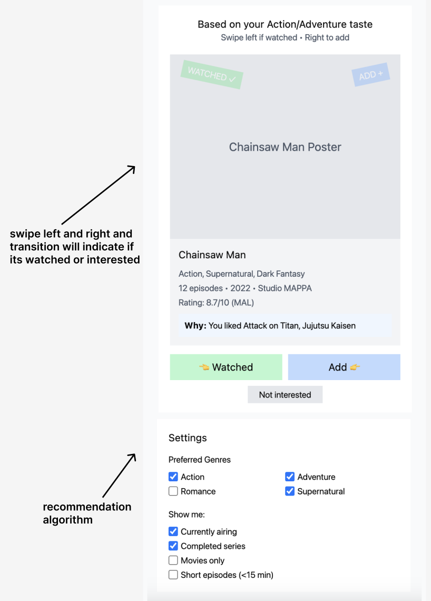
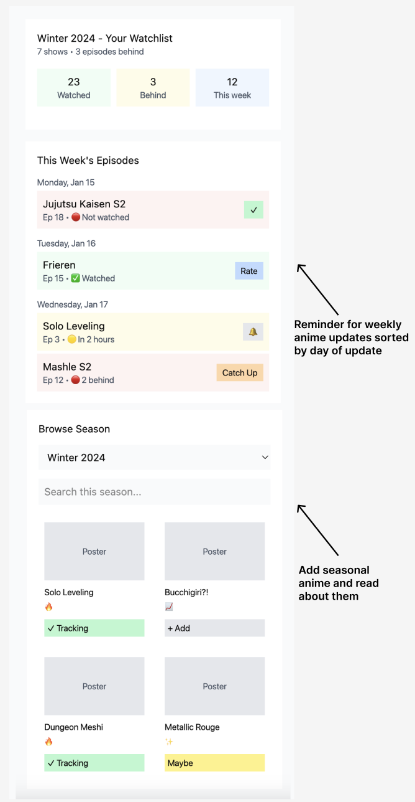
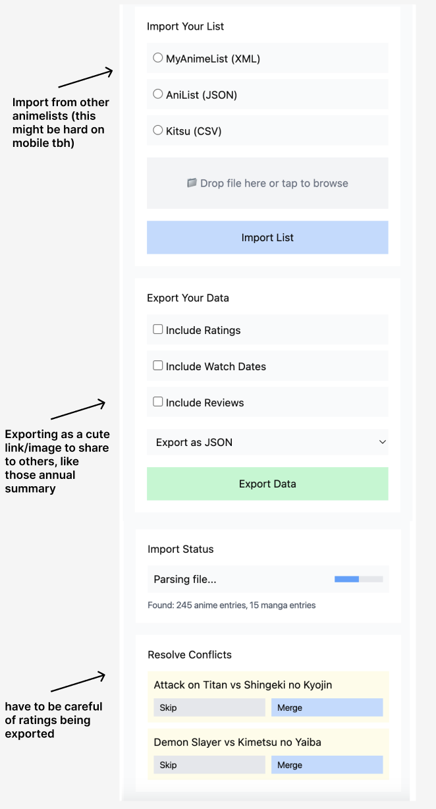
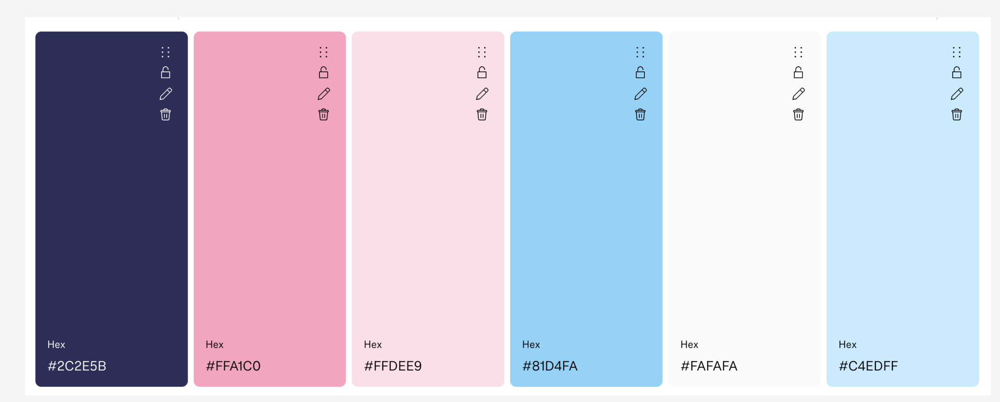

# Assignment 2 - Problem Statement

## Problem Domain: Anime Viewing and Social Sharing

Anime has become a significant part of my weekly routine and social identity. I watch 3-10 episodes per week with friends, and anime discussions are central to how I connect with my social circle. This domain matters to me because anime isn't just entertainment—it's part of my identity and how I bond with others. The challenge isn't just watching shows, but managing my viewing experience across multiple platforms and languages while maintaining social connections with friends and talk about anime and share their personal taste.

## Problem: Inefficient Anime List Management and Poor User Experience

Current anime tracking platforms make it difficult to maintain an accurate record of what I've watched overall. The user interfaces are clunky and require too much manual effort to keep lists updated, making me abandon tracking altogether. Additionally, there's no seamless way to switch between different language versions of anime titles, creating barriers when sharing recommendations with friends who watch in different languages. Seasonal anime also don't get properly updated or introduced to tracking platforms, leaving gaps in my ability to discover and track new releases. This results in losing track of my complete viewing history and missing out on new seasonal content.

## Stakeholders

1. **Anime watchers** – Regular viewers who struggle with maintaining accurate watch lists due to poor UI and high effort requirements. They are directly affected by abandoning tracking systems and losing their complete viewing history, making it difficult to remember what they've watched or share recommendations.

2. **Multilingual anime communities** – Groups of friends who watch anime in different languages (Chinese, English, Japanese). They are affected by the lack of seamless language switching in tracking platforms, creating barriers to sharing recommendations and discussing shows across language boundaries.

3. **Seasonal anime enthusiasts** – Viewers who follow new seasonal releases. They are impacted by poor seasonal anime updates and introductions on tracking platforms, missing out on discovering and tracking new content as it becomes available.

4. **Anime tracking platform developers** – Creators of existing tracking services who face user retention challenges due to poor UI/UX and high maintenance requirements. They need to innovate to reduce user effort and improve interface design.

## Evidence and Comparables

### Evidence

1. **Global Anime Viewership Statistics** ([How many people watch anime? (2025)](https://headphonesaddict.com/anime-statistics/)) – More than a third of the world population (2.88 billion people) watch anime, with over 100 million households globally watching at least 1 anime title on Netflix in 2020. Anime is the 3rd most in-demand subgenre worldwide with a 5.5% demand share.

2. **Massive Anime Database** ([Anime DataBase](https://anidb.net/)) – Anime database shows there are 14,100+ anime titles available, demonstrating the vast amount of content that viewers need to track.

3. **MyAnimeList Statistics** ([MyanimeList](https://myanimelist.net/topanime.php?limit=23885)) – MAL reports 23,885+ anime titles in their database, indicating the massive scale of content that anime fans need to manage and track.

4. **User Migration Patterns** ([Switching from MyAnimeList](https://thecartdriver.wordpress.com/2021/11/04/i-switched-from-using-myanimelist-to-anilist-and-heres-a-quick-review/)) – Users actively seek alternatives to existing tracking platforms due to interface limitations and lack of automation, showing demand for better solutions.

5. **Platform Partnership Evidence** ([Anime-Planet Strikes Deal With Lezhin Comics](https://www.animationmagazine.net/zh-CN/2020/08/lezhin-comics-strikes-exclusives-deal-with-anime-planet/)) – Anime-Planet reaches over 5 million monthly users worldwide and offers legal streaming links, demonstrating the commercial viability and user demand for integrated anime tracking solutions.

### Comparables

1. **MyAnimeList (MAL)** ([MyAnimeList](https://myanimelist.net/)) – The largest anime tracking platform launched in 2004 with millions of users. It popularized the list system but has an aging interface and lacks automation, requiring manual updates for each episode.

2. **AniList** ([AniList](https://anilist.co/)) – A modern anime tracking site with clean UI and customization features. It shows which airing shows users are watching and how many episodes they're behind, but still requires manual check-ins per episode with no native auto-tracking.

3. **Anime-Planet** ([Anime-Planet](https://www.anime-planet.com/)) – An anime and manga tracker founded in 2001 that reaches over 5 million monthly users worldwide. It offers legal streaming links and personalized recommendations but requires manual updates like other platforms.

4. **Kitsu** ([Kitsu](https://kitsu.app/explore/anime)) – A social anime tracking platform that started in 2013, rebranded after a 2016 seed investment by Viz Media. It introduced a modern feed and global community posts but has struggled with user adoption, with some users calling it "dead" due to limited active community.

5. **Platform-Specific Solutions** – Most major streaming platforms (Netflix, Crunchyroll, Hulu) have built-in watch history features, but these don't sync across platforms or provide unified tracking for users who watch content on multiple services.

---

## Application Pitch

### **AnimeShelf** - Your Customized Anime Library

**Motivation**: Current anime tracking platforms are too clunky and require too much effort to maintain, making it impossible to keep track of your complete viewing history while missing out on seasonal releases and struggling to share recommendations across different languages.

**Key Features**:

**1. Import & Export Compatibility** - AnimeShelf seamlessly imports your existing anime lists from MyAnimeList, AniList, or other platforms, preserving your complete viewing history without starting from scratch. You can also export your data anytime, ensuring you never lose your progress. This eliminates the barrier of switching platforms and ensures anime watchers can maintain their complete viewing history across different services.

**2. ‘Beli’ Rating System** - Rate anime through an intuitive swiping interface where you compare shows you've watched against each other, building a personalized ranking system. The app learns your taste preferences and provides increasingly accurate recommendations based on your "Beli" ratings. This creates a fun, gamified way for anime watchers to discover new content while helping multilingual communities share recommendations based on personalized taste profiles.

**3. Seasonal Anime Tracking** - Get notifications for weekly episodes you haven't watched yet, creating a personalized checklist that keeps you on track with seasonal anime. The app tracks your watching schedule and reminds you about missed episodes without being overwhelming. This ensures seasonal anime enthusiasts never fall behind on their favorite shows and can easily maintain their viewing momentum throughout each season. For people that prefer to stalk up and binge watch, there is also just a complete option.

---

## Concept Design

### Concept 1: "Beli"Rating

```
concept BeliRating [User, Anime]

purpose
  build a personalized ranking of anime based on user preferences

principle
  each anime watched by a user can be assigned an initial rating
  (awesome / ok / did not enjoy). Over time, the system refines
  this by asking the user to compare two anime, producing a
  personalized ranking of their library.

state
  a set of Ratings with
    a user User
    an anime Anime
    a score Category     // {awesome, ok, did not enjoy}

  a set of Comparisons with
    a user User
    an anime1 Anime
    an anime2 Anime
    a preferred Anime    // which one the user preferred

actions
  rateInitial (user: User, anime: Anime, score: Category)
    requires no prior rating for this (user, anime)
    effects record initial rating

  comparePair (user: User, anime1: Anime, anime2: Anime, preferred: Anime)
    requires user has rated both anime1 and anime2
    effects record user’s preference between anime1 and anime2

  getRanking (user: User) : (ranking: List[Anime])
    requires user has rated at least one anime
    effects return a personalized ranking based on initial ratings
    and comparisons
```

### Concept 2: ImportSupport

```
concept ImportSupport [User, Anime]

purpose
  allow users to import their existing anime lists from MyAnimeList (MAL)
  so they can preserve their watch history and ratings when switching
  to AnimeShelf.

principle
  given a MAL XML export file, the system parses each anime entry,
  adds it to the user’s library, and integrates MAL scores with the
  BeliRating system as initial ratings. This ensures continuity across
  platforms without requiring manual re-entry.

state
  a set of ImportRecords with
    a user User
    a sourceFile File
    a status Status   // {pending, complete, failed}

  a set of ImportedAnime with
    a user User
    an anime Anime
    a malScore Number   // optional, MAL 1–10 rating

actions
  uploadFile (user: User, file: File)
    requires file is a valid MAL XML export
    effects record new import request with status = pending

  parseFile (user: User, file: File): (entries: List[ImportedAnime])
    requires file is a valid MAL XML export
    effects extract anime entries with watch status and scores

  commitImport (user: User, entries: List[ImportedAnime])
    requires entries successfully parsed
    effects add anime to user’s AnimeShelf library
            and propagate scores into BeliRating as initial ratings
```

### Concept 3: Recommendation Swipe

```
concept RecommendationSwipe [User, Anime]

purpose
  help users discover new anime by presenting personalized
  recommendations that they can quickly sort into “watched”
  or “not watched,” with an option to rate if watched.

principle
  the system shows recommended anime to the user; swiping left
  means the anime has been watched (and user can assign a rating),
  while swiping right means the anime is not watched and should be
  added to the watchlist.

state
  a set of Recommendations with
    a user User
    an anime Anime

  a set of Watchlists with
    a user User
    an anime Anime
    a status Status   // {toWatch, watched}

actions
  showRecommendation (user: User): (anime: Anime)
    requires recommendation list exists for user
    effects return a recommended anime for the user

  swipeWatched (user: User, anime: Anime, score: Category)
    requires anime has been recommended to user
    effects mark anime as watched for this user
            and propagate score to BeliRating

  swipeToWatch (user: User, anime: Anime)
    requires anime has been recommended to user
    effects add anime to user’s watchlist with status = toWatch
```
### Concept 4: Seasonal Tracking
```
concept SeasonalTracking [User, Anime, Episode]

purpose
manage a user's progress on ongoing (seasonal) anime releases
and provide the mechanism for issuing notifications when new
episodes are available.

principle
users subscribe to anime titles they wish to follow. the system
maintains a global list of released episodes and tracks each user’s
highest watched episode for each subscribed anime. this allows
for easy tracking of unwatched content.

state
a set of Subscriptions with
a user User
an anime Anime
a status Status     // {following, completed, dropped}

a set of Progress with
a user User
an anime Anime
a lastWatchedEpisode Episode  // the highest episode number watched by the user

a set of Releases with
an anime Anime
an episode Episode            // the episode number
a releaseTime Time            // the actual time the episode became available

actions
subscribe (user: User, anime: Anime)
requires user is not already subscribed to this anime
effects adds a Subscription for the (user, anime) with status = following

markWatched (user: User, anime: Anime, episode: Episode)
requires user has an active Subscription for this anime
effects updates the Progress of (user, anime) to the given episode
only if the given episode is greater than the current lastWatchedEpisode

recordRelease (anime: Anime, episode: Episode, time: Time)
requires no Release currently exists for this (anime, episode)
effects records a new episode release in Releases and triggers the
system-level signal for notification syncs.

getUnwatchedCount (user: User, anime: Anime) : (count: Number)
requires user has an active Subscription
effects returns the number of released episodes greater than the user's
lastWatchedEpisode
```

## Essential Synchronizations

### Import to Initial Ratings

When imported MAL entries arrive, their scores should seed the BeliRating system.

```
sync importRatings
when ImportSupport.commitImport (user, entries): (importedAnime)
then for each entry in importedAnime
  BeliRating.rateInitial (user, entry.anime, mapScore(entry.malScore))
```

### Recommendation Swipe to Beli + Tracking

Swiping left integrates with BeliRating; swiping right builds the watchlist.

```
sync swipeWatchedToRating
when RecommendationSwipe.swipeWatched (user, anime, score)
then BeliRating.rateInitial (user, anime, score)

sync swipeToWatchToSeasonal
when RecommendationSwipe.swipeToWatch (user, anime)
then SeasonalTracking.subscribeSeason (user, anime)
```

### Seasonal Release to Notify Users

When a new seasonal episode comes out, notify subscribers.

```
sync releaseNotify
when SeasonalTracking.notifyRelease (anime, episode)
then sendNotification (usersSubscribedTo(anime), episode)
```

### Recommendation Refresh

When the user finishes rating or watching, update their recommendation feed.

```
sync refreshRecommendations
when BeliRating.comparePair (user, anime1, anime2, preferred)
then RecommendationSwipe.showRecommendation (user)
```

ImportSupport provides continuity by allowing users to bring in their existing MyAnimeList (MAL) records. These imported entries include scores, which are mapped into the BeliRating concept as initial ratings. BeliRating then refines user taste profiles through initial ratings and pairwise comparisons, producing a personalized ranking that drives recommendations.

SeasonalTracking addresses the challenge of staying current with ongoing releases. Users can subscribe to seasonal titles, receive notifications of new episodes, and mark episodes as watched. Syncs connect SeasonalTracking back to BeliRating by seeding ratings at the end of a season, with an option for users to submit mid-season ratings if they choose. This ensures that the user’s profile reflects their viewing habits without pressuring them to rate every episode individually.

RecommendationSwipe closes the loop by providing a discovery interface where users can sort through suggested anime with lightweight gestures. Swiping “watched” integrates the anime into BeliRating, while swiping “to watch” builds a personalized watchlist tied to SeasonalTracking. In this way, discovery, tracking, and rating are linked into a seamless experience.

Generic type parameters are instantiated as follows:

- User corresponds to registered app users.
- Anime corresponds to titles in the global anime catalog maintained by the app, enriched via import and seasonal updates.
- Episode (in SeasonalTracking) refers to numbered episode entries associated with a given anim

## UI Wireframes

### Rating Interface


_The rating system interface where users can compare anime and build their personalized rankings through intuitive swiping gestures._

### Recommendation Discovery


_The recommendation swipe interface that helps users discover new anime through personalized suggestions based on their Beli ratings._

### Seasonal Tracking


_The seasonal anime tracking interface that shows weekly episodes and provides notifications for unwatched content._

### Import/Export


_The import interface that allows users to seamlessly migrate their MyAnimeList data to AnimeShelf while preserving their complete viewing history._

### Color Palette


_The color palette used throughout AnimeShelf, designed to create a modern, clean interface that's easy on the eyes during extended anime tracking sessions with cute pink_

---

## User Journey

**Meet Alex, a 20-year-old college student who absolutely adores romantic anime.** He's been following seasonal romance anime for the past two years, but he's grown increasingly frustrated with MyAnimeList's clunky interface. Every time he tries to update his progress on the latest episode of "My Happy Marriage" or "The Dangers in My Heart," he has to navigate through multiple pages and remember exactly which episode he's on. The interface feels outdated and requires too much effort just to mark "watched" on an episode.

**Alex discovers AnimeShelf through a friend's recommendation and decides to give it a try.** He starts by using the Import/Export interface (shown in the wireframe above) to seamlessly transfer his entire MyAnimeList history. Within minutes, all his watched anime, scores, and current seasonal shows are imported into AnimeShelf. He's amazed that he doesn't have to manually re-enter any anime titles he's already watched.

**Now Alex can finally track his seasonal romance anime properly.** Using the Seasonal Tracking interface, he can see all his current seasonal shows in one clean dashboard. When a new episode of "A Sign of Affection" airs, he gets a gentle notification reminding him to watch it. The interface is so much cleaner than MyAnimeList - he can mark episodes as watched with a simple tap and see his progress at a glance.

**The real game-changer comes when Alex starts using the rating system.** He's always argued with his anime friends about his taste preferences - they constantly debate whether "Toradora!" or "Your Name" is the better romance anime, and Alex never has a clear way to defend his opinions. The Rating Interface allows him to compare anime he's watched through intuitive swiping gestures, building concrete evidence for his preferences. As he compares more anime, the system learns his taste profile and gives him data-backed rankings to settle these arguments with his friends.

**Finally, Alex discovers new romance anime through the Recommendation Discovery feature.** Based on his ratings and viewing history, the app suggests "Horimiya" and "Kaguya-sama: Love is War" - both of which he absolutely loves. The swiping interface makes it easy to quickly sort through recommendations, marking some as "watched" and others as "to watch."

**Six months later, Alex has a perfectly organized anime library with personalized rankings and never misses a seasonal romance anime.** He can easily share recommendations with friends who watch in different languages, and his viewing history is always up-to-date without the constant manual effort that made him abandon MyAnimeList. AnimeShelf has transformed his anime-watching experience from a frustrating chore into an enjoyable, seamless part of his daily routine.
